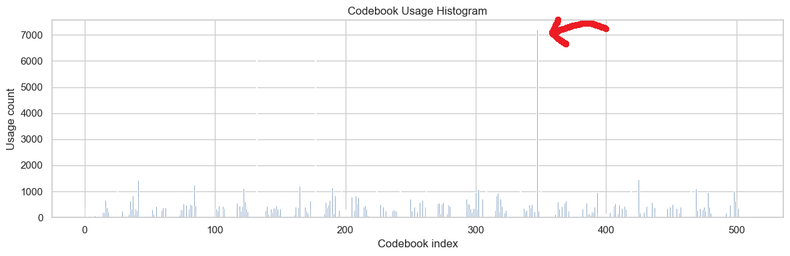
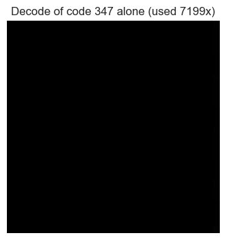

# CONVOLUTIONAL VQ-VAE on MNIST

A from scratch PyTorch implementation of a **Vector Quantized Variational Autoencoder** (VQ-VAE, [van den Oord et al., 2017](https://arxiv.org/abs/1711.00937)) trained on MNIST (resized to 32×32).

---

## The Core Idea

A standard VAE learns a **continuous** latent space regularized towards a Gaussian prior. A VQ-VAE instead learns a **discrete** latent space: the encoder output is snapped to the nearest vector in a learned **codebook** (a finite dictionary of embedding vectors). The decoder only ever sees codebook vectors.

## The Maths

### 1. Quantization step

Given a codebook $\mathcal{C} = \{e_1, e_2, \dots, e_K\}$ with $e_k \in \mathbb{R}^D$ (here $K = 512$, $D = 4$), each encoder output vector $z_e(x)$ is replaced by its nearest codebook entry:

$$
z_q(x) = e_k, \quad \text{where } k = \arg\min_j \; \| z_e(x) - e_j \|_2^2
$$

The squared distances are computed efficiently without loops by expanding the square:

$$
\| z - e_j \|^2 = \|z\|^2 - 2\, z^\top e_j + \|e_j\|^2
$$

which is just two sums and one matrix multiplication over the whole batch.

### 2. Loss function

Since $\arg\min$ has no gradient, the loss has **three terms**, each training a different part of the model:

$$
\mathcal{L} = \underbrace{\frac{\| x - \hat{x} \|_2^2}{\sigma^2_{\text{data}}}}_{\text{reconstruction}} \;+\; \underbrace{\| \text{sg}[z_e(x)] - z_q(x) \|_2^2}_{\text{codebook loss}} \;+\; \beta \, \underbrace{\| z_e(x) - \text{sg}[z_q(x)] \|_2^2}_{\text{commitment loss}}
$$

where $\text{sg}[\cdot]$ is the **stop-gradient** operator (`.detach()` in PyTorch) and $\beta = 0.25$.

The reconstruction loss is normalized by the data variance $\sigma^2_{\text{data}}$ so its scale is comparable to the VQ terms regardless of the dataset.

### 3. Straight-Through Estimator (STE)

Quantization is non-differentiable, so during the backward pass the gradient is copied straight from $z_q$ to $z_e$ as if quantization were the identity:

$$
z_q = z_e + \text{sg}[z_q - z_e]
$$

In code: `codes = z + (codes - z).detach()`. Forward pass gives $z_q$, backward pass gives $\frac{\partial \mathcal{L}}{\partial z_q}$ directly to the encoder.

### 4. Perplexity (codebook usage metric)

To monitor how many codes are actually being used, compute the average code assignment distribution $\bar{p}_k$ over a batch and its exponentiated entropy:

$$
\text{perplexity} = \exp\left( -\sum_{k=1}^{K} \bar{p}_k \log \bar{p}_k \right)
$$

- Perplexity $= K$ => all codes used uniformly (ideal).
- Perplexity $= 1$ => codebook collapse (everything maps to one code).

We achived a perplexity of near 200 codes being used, this is fair for the MNIST dataset as background is captured majorly by a single code.

Confirmed by picking it out and passing it through the decoder. This was the output 🤌

---

## Architecture

**Encoder** — 3 strided conv blocks (Conv → BatchNorm → ReLU), each halving spatial size:
`(1, 32, 32) → (8, 15, 15) → (16, 8, 8) → (4, 4, 4)` — a 4×4 grid of 4-dim latent vectors.

**Vector Quantizer** — codebook of $K = 512$ entries, $D = 4$ dims, initialized uniformly in $[-1/K,\ 1/K]$. The latent grid is reshaped to `(B·H·W, D)` so every spatial position is quantized independently — one image is represented by **16 discrete codes**.

**Decoder** — 3 transposed-conv blocks mirroring the encoder, ending in a Sigmoid (pixel values in $[0,1]$).

## Training Setup

| Hyperparameter | Value |
|---|---|
| Optimizer | Adam, lr = 5e-4 |
| Batch size | 64 |
| Iterations | 25,000 |
| $\beta$ (commitment weight) | 0.25 |
| Codebook size $K$ | 512 |
| Latent dim $D$ | 4 |

## Results

| Metric | Value |
|---|---|
| Final train / eval loss | 0.196 / 0.197 |
| Final train / eval perplexity | 184.7 / 173.5 (of 512 max) |
| kNN accuracy on continuous latents $z_e$ | 95.7% |
| kNN accuracy on quantized latents $z_q$ | 94.5% |

The quantized latents lose only ~1% of linear separability vs the continuous ones — the discrete bottleneck retains almost all class information. TSNE plots of both latent spaces show clear digit clusters, and the codebook usage histogram confirms a healthy spread of active codes (no collapse).

---

## What I Implemented

- [x] `VectorQuantizer` module from scratch: vectorized nearest-neighbour search via the expanded L2 distance trick, one-hot `scatter_` encodings, and perplexity computation.
- [x] Convolutional encoder/decoder with strided convs / transposed convs + BatchNorm.
- [x] The full three-term VQ-VAE loss with stop-gradients and the straight-through estimator.
- [x] Iteration-based training loop with periodic evaluation, tracking loss + perplexity histories and latent snapshots per eval.
- [x] Model checkpointing (`state_dict`) and training-history persistence with pickle.
- [x] Analysis: loss curves, TSNE of encoded vs quantized latents, original-vs-reconstruction grids, codebook usage histogram, kNN probing of latent quality.

## Concepts I Learned

1. **Discrete latent spaces** — why they're useful (compression, priors like PixelCNN/transformers can model discrete tokens, no posterior collapse like standard VAEs).
2. **Straight-through gradient estimation** — the `z + (z_q - z).detach()` trick to backprop through a non-differentiable argmin.
3. **Stop-gradient decoupling** — using `.detach()` to route different loss terms to different parameters (codebook vs encoder) within a single backward pass.
4. **Codebook collapse & perplexity** — monitoring effective codebook usage; low perplexity means dead codes.
5. **Vectorized pairwise distances** — computing all $N \times K$ L2 distances with a single matmul instead of loops.
6. **Commitment loss & β** — the encoder must "commit" to codebook entries; without it, encoder outputs grow unboundedly since the codebook lags behind.
7. **Variance-normalized reconstruction loss** — keeps loss terms on comparable scales across datasets.
8. **Latent probing** — using kNN/TSNE on frozen latents as a cheap measure of representation quality.

## Quick Notes for Future Me

- **Gradients**: reconstruction → encoder+decoder (via STE); codebook loss → codebook only; commitment → encoder only. The codebook receives *no* gradient from reconstruction.
- **Shape gymnastics**: quantize per spatial position — `(B, D, H, W) → permute → (B·H·W, D)`, quantize, then reshape back. Forgetting `.contiguous()` after `permute` breaks `.view()`.
- If perplexity stays low early on, try: smaller codebook, EMA codebook updates (VQ-VAE-2 style), or restarting dead codes.
- $\beta$ between 0.1–2.0 is reportedly robust (paper uses 0.25).
- Codebook initialized to `uniform(-1/K, 1/K)` — tiny values so early nearest-neighbour assignments aren't dominated by init scale.
- A natural next step: train an autoregressive prior (PixelCNN / small transformer) over the 4×4 grids of code indices to *generate* new digits, since VQ-VAE alone only reconstructs.

## Files

- [vq_vae.ipynb](vq_vae.ipynb) — everything: model, training, analysis.
- `conv_vqvae_state_dict.pt` — trained weights (gitignored artifacts may vary).
- `train_history.pkl` — pickled loss/perplexity histories and latent snapshots.
